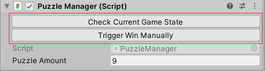

  

<a class="item active" data-tab="first"></a>
<a class="item" data-tab="second"></a>

<!--
****************************************
ENGLISH TAB
****************************************
-->

<!--
****************************************
POLISH TAB
****************************************
-->

  

  Stworzenie przycisków w skrypcie jest jak najbardziej możliwe i bardzo przydatne. Wyobraź sobie, że masz w grze walutę, którą możesz przeznaczyć na jakieś elementy. Zamiast spędzać 10 minut w edytorze, żeby uzyskać określoną kwotę, możesz kliknąć przycisk wywołujący funkcję <em>AddMoney()</em> i gotowe. Można oczywiście sięgnąć po konsolę i wpisać odpowiednią komendę, ale w takim wypadku, mam wrażenie, że przycisk jest wygodniejszy. Inna sytuacja: chcesz sprawdzić czy wszystkie książki dają po przeczytaniu poprawne powiadomienie. Możesz poszczególną książkę odblokowywać chodząc po świecie i je wykupując, napisać specjalną komendę do swojej konsoli odblokowującą wszystkie z nich albo.. stworzyć odpowiedni przycisk. Przygotowanie pod skryptami przycisków jest szczególnie przydatne w końcowych etapach sprawdzania projektu lub weryfikacji poprawności działania danego skryptu. Pod taki przycisk podpiąć można nie tylko jakąś operację manipulującą bieżącym stanem gry(dodanie środków, punktów umiejętności, obiektów), ale również sprawdzającą obecną sytuację(status). Redukuje to potrzebę wpisywania <em>Debug.Log</em> w konkretnym miejscu kodu, a po skończonej weryfikacji, jego komentowania lub kasowania. Może się zdarzyć, że ponownie zajdzie potrzeba sprawdzenia działania tego samego skryptu i znowu będziemy zmuszeni dodawać/odkomentowywać polecenia wypisujące informacje do konsoli, więc alternatywa z przyciskiem jest bardzo użyteczna. Gotowe rozwiązanie z którego można skorzystać to <em>EasyButtons</em>. Pozwala tworzyć przyciski za pomocą specjalnego atrybutu umieszczanego nad funkcjami, <strong>[Button]</strong>. Jeżeli przygotujemy funkcje i opatrzymy je wspomnianym atrybutem, w inspektorze Unity otrzymamy następujący efekt:
  

   

  

   

  

  W powyższym przykładzie, pierwszy przycisk służy mi do weryfikacji aktualnego stanu minigry, drugi do uruchomienia wygranej, niezależnie od stanu rozgrywki. Implementacje wyglądają następująco:  
  

   


[Button]
public void CheckCurrentGameState()
{
Debug.Log($"<b>{PuzzleStatus}</b> out of " +
$"<b>{\_puzzleAmount}</b> blocks are placed correctly.");
}


   


[Button]
public void TriggerWinManually()
{
TriggerWin();
}


   

  

  W oczy rzucić Ci się może to, że funkcje nie mają zdefiniowanych żadnych parametrów. W rozwiązaniu <em>EasyButtons</em> nie można opatrzyć atrybutem <strong>[Button]</strong> funkcji z parametrami, bo przycisk nie będzie dostępny w inspektorze. Na pierwszy rzut można uznać to za przeszkodę. Jeżeli jednak zależy nam na możliwości przekazania argumentów, możemy to obejść wywołując wewnątrz metody kolejną funkcję, która już bedzie mogła posiadać parametry. Prosty przykład:  
  

   


[Header("TeleportToDestination Button Data")]
[SerializeField]
private float \_X;

[SerializeField]
private float \_Y;

[SerializeField]
private float \_Z;

[Button]
public void TeleportToDestination()
{
SetCharacterPosition(\_X, \_Y, \_Z);
}


   

  

  Można sobie zatem łatwo z tym poradzić i nie trzeba ingerować w rozwiązanie. Użycie <em>EasyButtons</em> jest naprawdę proste. Wystarczy dodać do własnego projektu udostępniony kod z repozytorium, w skrypcie w którym chcemy mieć przycisk nie zapomnieć o using'u i opatrzeć przygotowaną, bezparametrową funkcję atrybutem <strong>[Button]</strong>. To wszystko!
  

   

  

    

      <i class="github icon"></i>
      EasyButtons, repozytorium
    

    <a href="https://github.com/madsbangh/EasyButtons" target="_blank" style="margin-top: 2%;">
      

        
Sprawdź

        

          <i class="right arrow icon"></i>
        

      

    </a>
  

