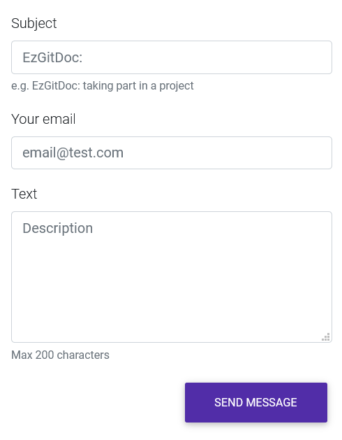

  

<a class="item active" data-tab="first"></a>
<a class="item" data-tab="second"></a>

<!--
****************************************
ENGLISH TAB
****************************************
-->

<!--
****************************************
POLISH TAB
****************************************
-->

  

    

      
    

  

  
Źródło: <a href="https://formspree.io/" target="_blank">formspree.io</a>

   

  

  Rozwiązanie nazywa się <strong>Formspree</strong> i pozwala przygotować sprawny formularz kontaktowy w mniej niż minutę, bez konieczności użycia kodu "serwerowego" np. PHP. Jest to moim zdaniem szczególnie przydatne w serwisie GitHub, w choćby takim portfolio, które ma dość duża grupa użytkowników i chce mieć fajną opcję kontaktu w np. <a href="https://ryanfitzgerald.github.io/devportfolio/" target="_blank">takim szablonie</a>. Formspree w bezpłatnej wersji spokojnie wystarczy do użytku w ramach portfolio lub open source'owego rozwiązania. Szczegółowo opisane plany dostępne są <a href="https://formspree.io/plans" target="_blank">tutaj</a>. Bazowy snippet formularza, który można znaleźć na stronie Formspree prezentuje się następująco:
  

   



  <form 
    action="https://formspree.io/FORM_ID"
    method="POST">

    <label>
      Your Name:
      <input type="text" name="name">
    </label>

    <label>
      Your Email:
      <input type="email" name="_replyto">
    </label>

    <label>
      Message:
      <textarea name="message"></textarea>
    </label>

    <input type="submit" value="Send">

  </form> 
  

   

  

  Żeby korzystać z Formspree, należy dodać ten snippet do swojej strony(lub jeżeli wcześniej mieliśmy formularz kontaktowy, odpowiednio zmodyfikować) i podmienić <em>FORM_ID</em>(druga linia) na adres e-mail, na który mają być kierowane wiadomości.
  

  

  Ze strony, z przygotowanym formularzem, należy wysłać "testową" wiadomość. Pojawi się informacja o tym, że aby móc odbierać wiadomości przekierowane przez Formspree, trzeba aktywować opcję przez link wysłany na podaną skrzynkę.
  

  

  Logujemy się do poczty, która została podana za <em>FORM_ID</em> i klikamy w link aktywacyjny. Od tej pory formularz kontaktowy jest sprawny. Jeżeli korzystaliśmy z ww. snippet'u, pozostaje nam ostylowanie go wedle własnych upodobań. Poniżej przykład z użyciem dostępnych komponentów framework'a MDBootstrap
  

   



  <form method="POST" action="https://formspree.io/email@gmail.com">
    

      <label>Subject</label>
      <input type="text" name="_subject" class="form-control" placeholder="EzGitDoc: " autocomplete="off" required>
      <small class="form-text text-muted">e.g. EzGitDoc: taking part in a project</small>
    

    

      <label>Your email</label>
      <input type="email" name="_replyto" class="form-control" placeholder="email@test.com" autocomplete="off" required>
    

    <!-- Message block -->
    

      <label for="commentArea">Text</label>
      <textarea class="form-control" maxlength="200" rows="5" id="commentArea" autocomplete="off" name="message" placeholder="Description" required></textarea>
      <small class="form-text text-muted">Max 200 characters</small>
    

    

      <button type="submit" class="btn btn-deep-purple">Send Message</button>
    

  </form>
  

   

  

  i otrzymany rezultat
  

   

  

   

  

  Formspree posiada oczywiście filtr antyspamu, reCAPTCHA, który aktywuje się po kliknięciu przycisku odpowiadającego za wysłanie wiadomości. Nie trzeba też dokonywać rejestracji aby móc z niego korzystać, ale jak informują twórcy, będąc zarejestrowanym, otrzymuje się dostęp do większej liczby możliwości. Warto sprawdzić, może się przyda :)
  

   

  

    

      <i class="globe icon"></i>
      Formspree
    

    <a href="https://formspree.io/" target="_blank" style="margin-top: 2%;">
      

        
Sprawdź

        

          <i class="right arrow icon"></i>
        

      

    </a>
  

