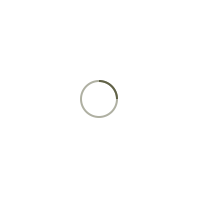

  

    
  

  

    
  

<table class="ui celled striped tablet stackable table">
  <thead>
    <tr><th colspan="3">
      Informacje
    </th>
  </tr></thead>
  <tbody>
    <tr>
      <td>
        <i class="info circle icon"></i> Cel
      </td>
      <td class="justify-text font-balooChettan2">Pełnoprawna, złożona gra edukacyjna, pomagająca w poznaniu 5 podstawowych języków programowania jako projekt aplikacji na pracę inżynierską.</td>
    </tr>
    <tr>
      <td>
        <i class="lab icon"></i> Technologie
      </td>
      <td>Unity 3D</td>
    </tr>
    <tr>
      <td class="collapsing">
        <i class="users icon"></i> Rola, (rozmiar zespołu)
      </td>
      <td class="font-balooChettan2">Lider, Gamedev (zespół 2-os.)</td>
    </tr>
    <tr>
      <td>
        <i class="setting icon"></i> Odpowiedzialność
      </td>
      <td>
      <ul class="font-balooChettan2">
        <li>Opracowanie funkcjonalności aplikacji</li>
        <li>Realizacja przypisanych zadań</li>
        <li>Organizacja pracy zespołu</li>
        <li>Sporządzenie dokumentacji w serwisie GitHub</li>
      </ul>
      </td>
    </tr>
    <tr>
      <td>
        <i class="clock icon"></i> Ramy czasowe
      </td>
      <td class="font-balooChettan2">16.06.2019 - 24.11.2019*   
*wliczając drobne korekty i testy funkcjonalne, 07.12.2019
</td>
    </tr>
    <tr>
      <td>
        <i class="star icon"></i> Sukcesy
      </td>
      <td class="font-balooChettan2">
        <ul>
          <li>Przygotowanie pełnoprawnej gry</li>
          <li>Zwiększenie znajomości środowiska Unity</li>
          <li>Zapoznanie się z językami, które gra porusza (m.in. PHP i Java)</li>
          <li>Zarządzanie rozbudowanym projektem</li>
        </ul>
      </td>
    </tr>
  </tbody>
</table>

  

    

    

    

    

    

    

    

    

    

  

  <!-- Add Pagination -->
  

<!-- Initialize Swiper -->

 

<h4>Przegląd aplikacji oraz pokazanie m.in. trybu puzzle</h4>

 
 

 

<h4>Urywki z kilku poziomów i trybów rozgrywki </h4>

 
 

 
 

  

    
Zasoby

  

  

    

      

        

          <i class="github icon"></i>
          Repozytorium
        

         
        <a href="https://github.com/trolit/projectZero" target="_blank">
        

          
Sprawdź

          

            <i class="right arrow icon"></i>
          

        

        </a>
      

      

        

          <i class="chess knight icon"></i>
          Gra
        

         
        <a href="https://github.com/trolit/projectZero/releases/download/v0.92/ProjectZero_installer.exe" target="_blank">
        

          
Pobierz

          

            <i class="right arrow icon"></i>
          

        

        </a>
      

    

  

<!-- Image Modal -->

  

    

      
    

  

   
  

    

      Zamknij podgląd
      <i class="file image icon"></i>
    

  

